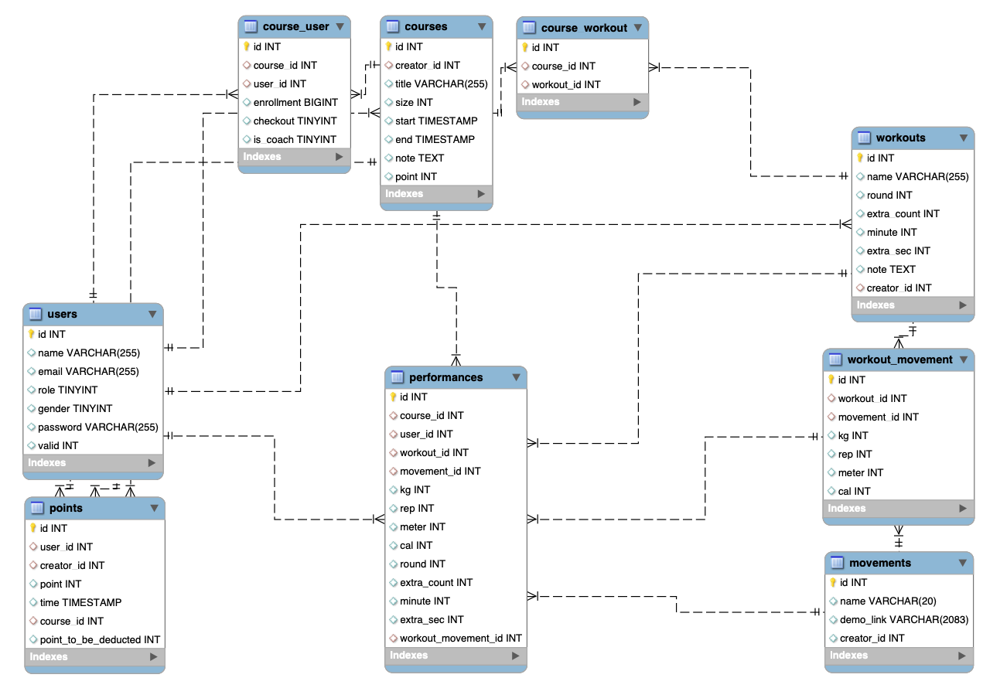

# CrossFit CRM

A well-rounded gym system including **membership administration**, **workout customization**, **performance analysis**, and **course management**.

## Table of content

- [Link](#Link)
- [Features](#Features)
- [Technologies](#Technologies)

## Link

https://crossfit-crm.online/

> Test account:
>
> - Role: Gym Owner
> - Email: test@email.com
> - Password: test

## Features

- Membership administration:
  - Validate users
  - Update roles
  - Manage points

- Workout customization:
  - Manange movements
  - Manange workouts

- Course management:
  - Manange Courses
  - Enroll Courses
  - Checkout Courses

- Performance analysis:
  - Manange performances
  - Analyze performances
  - Compete in Leaderboards

## Architecture

## Database Schema

## Technologies

- Server: Node, Express
- Client: React, MUI
- Database: MySQL
- Cloud Service(AWS): EC2, SES
- Test: Mocha, Chai
